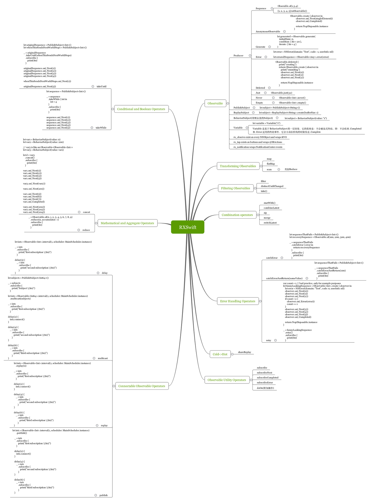

# RXSwiftDemo
> 额,学习一下RXSwift.
**demo使用须知.需要在沙盒Documents/下创建一users.plist文件/或者将工程/plist/users.plist拷贝到沙盒中即可.**
---
[RXSwift教程](http://blog.csdn.net/wo190096/article/details/54708283)
---

---
[moya + RxSwift 进行网络请求](http://blog.csdn.net/Three_Zhang/article/details/61923164)

